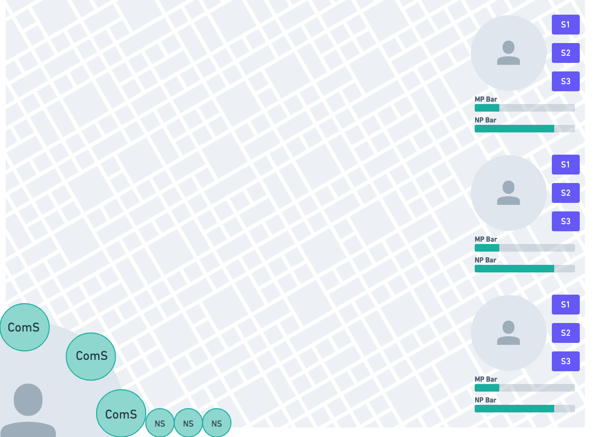

# Battle Systems

[Editor](https://whimsical.com/6E7fFBfArJ1qkjfuMHtGE8) (login by gmail homu@ramadoka.com)

### Screen

</img>

Legends:
- ComS: *Commander's skill*
  
  At a given turn, only 3 skill active from possible 10 (?) or 15 (?).
  This skill is obtained by doing Gacha Skills.

- NS: *Next Skill*

  This skill will be added to active skill  when one or more active skills is used.

- Character Image: *Hero*

  The heroes can be obtained by doing hero gacha. (or by buying?)

- S1/S2/S3 (button): *Special Character Skill*

  user can set up to 3 active character's skill from possible 10 (?)
  each character's will probably has different amount skill set.
  These skill is unlocked when the character reach a certain level (?), or probably better if some has requirement to be unlocked by finishing event.

  User should also be able to do a character normal attack by doing something.

- MP Bar
  Usage of character's skill will consume that character's MP.

- NP Bar
  A certain mechanic should fills this bar. #TODO (undecided)

## Systems
On Each turn, the player will be allowed to execute 3 action (which consists of)
- activating commander's skill.
- attacking normally.
- activating hero's skill.
- activating hero's special attack.